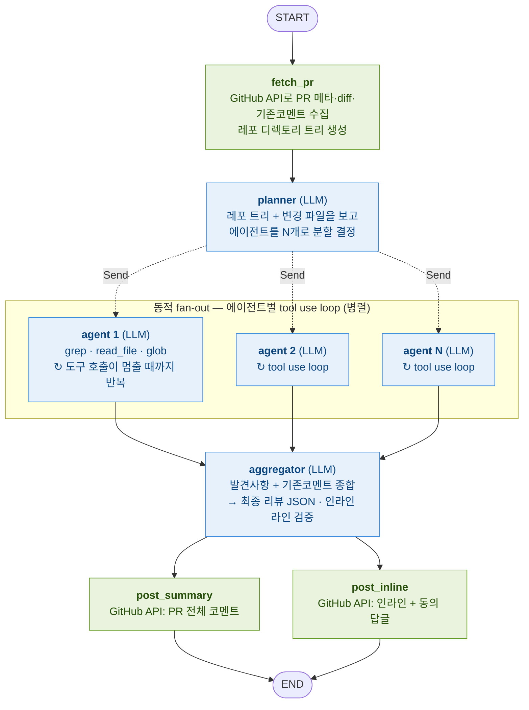

# GitOps PR 리뷰봇

LangGraph + 로컬 LLM(OpenAI-compatible)으로 GitOps 레포 PR을 자동 리뷰한다.
LLM이 도구(grep/read/glob)로 레포를 능동적으로 탐색하는 **tool use loop** 구조이며,
변경 규모에 따라 **에이전트를 동적으로 나눠 병렬 리뷰**한다.

## 아키텍처



> 파란 노드 = LLM 호출, 초록 노드 = GitHub API I/O.
> `planner`가 런타임에 `Send`로 에이전트를 동적 생성(fan-out) → 각 에이전트가 도구로 레포를
> 탐색하는 tool use loop를 독립적으로 돌고(병렬) → 모두 끝나면 `aggregator`로 합류(fan-in)한다.
> 각 에이전트의 발견사항은 `Annotated[list, operator.add]` reducer로 합쳐진다.
> **에이전트의 도구 반복 루프는 노드 내부**(agent.py)에서 돌며, 그래프 토폴로지는 PR 크기와 무관하게 동일하다.

### 왜 이 구조인가

- **tool use loop** — base 파일을 통째로 프롬프트에 넣지 않는다. LLM이 그때그때 필요한
  조각만 `grep`/`read_file`로 요청한다. 한 LLM 호출의 입력이 작아서 prefill이 빠르고,
  **게이트웨이 타임아웃(예: 60초)을 넘기지 않는다.** "큰 입력 한 방"이 타임아웃의 원인이었다.
- **능동 탐색** — GitOps의 핵심인 "빠뜨린 연관 설정 / 환경 간 불일치"는 diff만 봐선 못 잡는다.
  LLM이 다른 환경 파일을 `grep`으로 직접 들춰봐야 잡힌다. tool use loop가 이걸 가능케 한다.
- **동적 멀티에이전트** — planner가 **레포 디렉토리 트리 + 변경 파일**을 보고 에이전트 수를 정한다.
  작은 PR은 1개, helm·kustomize가 섞이면 나눠서 병렬 리뷰. 트리로 형제 환경(dev2 옆 qa2·prd-* 등)을
  파악해 환경 일관성 점검 대상을 focus에 구체적으로 배치한다. LangGraph `Send` API로 런타임 fan-out.

### tool use loop (agent.py)

각 에이전트는 다음을 도구 호출이 멈출 때까지 반복한다:

```
messages = [system(담당 영역), user(시작 지시)]
while 턴 < max_turns:
    msg = LLM(messages, tools)          # 다음 행동 결정
    messages.append(msg)
    if msg에 tool_calls 없음:            # 최종 발견사항
        return findings
    각 tool_call 실행 → 결과를 messages에 append   # 관찰을 누적
턴 초과 → 도구 없이 결론 강제
```

LLM이 `grep("replicas", "overlay/prd-*")` 같은 도구를 요청하면 코드가 **로컬 레포에서**
실행해 결과를 돌려준다. LLM은 두뇌(판단), 코드는 손발(실행)이다.

### 도구 (tools.py)

모든 도구는 로컬 체크아웃(`--repo-dir`)에서 실행되며 레포 밖 접근은 차단된다.

| 도구 | 용도 |
|---|---|
| `get_changed_files` | PR 변경 파일 목록 |
| `get_diff(path?)` | 특정 파일의 변경 diff (라인번호 주석 포함) |
| `read_file(path, start?, end?)` | 파일 내용 (라인 범위 옵션) |
| `grep(pattern, path_glob?)` | 정규식 검색 — 환경 비교·참조 확인의 핵심 |
| `glob(pattern)` | 파일 경로 탐색 |
| `list_dir(path)` | 디렉토리 목록 |

### 동적 fan-out과 fan-in

```python
g.add_conditional_edges("planner", route_to_agents, ["agent"])  # Send로 N개 띄움
g.add_edge("agent", "aggregator")                                # 모두 끝나면 fan-in
```

- `route_to_agents`가 planner 결과를 보고 `[Send("agent", payload) for ...]`를 반환 →
  LangGraph가 agent 노드를 **에이전트 수만큼 동적으로** 병렬 생성한다.
- 여러 agent 인스턴스가 같은 `agent_findings` 키에 써야 하므로 **reducer**
  (`Annotated[list, operator.add]`)로 결과를 합친다.
- 모든 agent가 끝나야 aggregator가 1회 실행된다.

> **단일 GPU 주의**: 에이전트를 병렬로 띄워도 LLM 인스턴스가 하나면 요청이 큐잉된다.
> `--agent-concurrency 1`로 직렬화하는 게 안전할 수 있다 (LLM 호출은 `--llm-concurrency`로도 제한됨).

## 동작 특징

- **리뷰 중복 방지**: 이미 달린 코멘트(봇/사람)를 aggregator에 전달. 같은 취지의 지적은
  새로 달지 않고 기존 인라인 코멘트에 "동일한 의견입니다" 답글(미지원 서버면 일반 코멘트 fallback).
- **인라인 vs 통합리뷰 분리**: aggregator가 만든 (path, line)이 실제 diff 라인 안에 있으면
  **인라인 코멘트**, 없으면(변경 안 된 라인·다른 환경 파일 등) **통합리뷰**(전체 코멘트 하단)로 보낸다.
  LLM이 라인을 부정확하게 잡아도 GitHub이 거부하지 않게 거르는 안전장치. 어디로 갔는지 로그에 남는다.
- **상세 로깅**: `--debug`면 LLM 요청/응답 전문, 에이전트 이름·loop(턴) 번호, 도구 호출 인자/결과,
  인라인 등록 실패 사유를 출력한다. INFO는 흐름 요약만.
- **thinking 제어**: Qwen3 thinking은 출력 토큰을 늘려 타임아웃을 유발할 수 있어 기본 비활성
  (`enable_thinking=false` + 탐색 호출은 빠르게). 깊은 판단이 필요하면 `--think`로 켠다.
- **JSON 견고성**: 응답 전체를 감싼 코드펜스만 벗기고(summary 내부 펜스는 보존),
  문자열 내 raw 개행 허용, line/comment_id의 문자열→정수 보정, 실패 시 복구 재시도.

## 파일 구성

| 파일 | 역할 |
|---|---|
| `main.py` | 엔트리포인트 |
| `graph.py` | LangGraph 파이프라인 (planner → fan-out → agents → aggregator → 게시) |
| `agent.py` | **tool use loop** — 에이전트 1개를 도구 호출이 멈출 때까지 구동 |
| `tools.py` | 로컬 fs 도구 + native function calling 스키마 + 실행 디스패처 |
| `llm.py` | OpenAI-compatible 래퍼 (`chat`, `chat_with_tools`, thinking 제어) |
| `github_api.py` | GitHub REST API (httpx) — PR 메타 조회와 게시 전용 (파일 읽기는 로컬 도구가 담당) |
| `diff_utils.py` | diff 파싱·라인번호 주석, 파일 단위 분할, 인라인 코멘트 검증 |
| `prompts.py` | planner / agent / aggregator 프롬프트 |
| `config.py` | CLI 인자/환경변수 |
| `REVIEW_RULE.example.md` | 룰 파일 권장 포맷 예시 (에이전트가 read해서 참고) |

## 설정

CLI 파라미터 또는 환경변수. **CLI 인자 > 환경변수** 우선순위.

| CLI | 환경변수 | 필수 | 설명 |
|---|---|---|---|
| `--github-token` | `GITHUB_TOKEN` | ✅ | GitHub PAT (PR 읽기/코멘트) |
| `--repo` | `GITHUB_REPOSITORY` | ✅ | `owner/repo` |
| `--pr-number` | `PR_NUMBER` | ✅ | 리뷰할 PR 번호 |
| `--repo-dir` | `REPO_DIR` | ✅* | **로컬 레포 경로** (PR 브랜치 checkout됨). 도구가 여기서 파일을 읽음. 기본 `.` |
| `--llm-base-url` | `LLM_BASE_URL` | ✅ | OpenAI-compatible 엔드포인트 |
| `--llm-model` | `LLM_MODEL` | ✅ | 모델 이름 |
| `--llm-api-key` | `LLM_API_KEY` | | 기본 `dummy` |
| `--max-turns` | `MAX_TURNS` | | 에이전트당 tool use loop 최대 턴, 기본 15 |
| `--max-agents` | `MAX_AGENTS` | | planner가 만들 최대 에이전트 수, 기본 5 |
| `--agent-concurrency` | `AGENT_CONCURRENCY` | | 에이전트 동시 실행 수, 기본 2 (단일 GPU면 1) |
| `--llm-timeout` | `LLM_TIMEOUT` | | LLM 호출당 대기(초), 기본 600 |
| `--llm-concurrency` | `LLM_CONCURRENCY` | | LLM 동시 호출 수, 기본 2 |
| `--think` | `THINK` | | thinking 활성 (기본 비활성) |
| `--github-api-url` | `GITHUB_API_URL` | | GitHub REST API base URL. GHE면 `https://<host>/api/v3`, 기본 `https://api.github.com` |
| `--log-level` | `LOG_LEVEL` | | DEBUG/INFO/WARNING/ERROR, 기본 INFO |
| `--debug` | `DEBUG=1` | | `--log-level DEBUG` 단축 — LLM 요청/응답 전문 출력 |
| `--language` | `REVIEW_LANGUAGE` | | 리뷰 언어, 기본 Korean |
| `--dry-run` | `DRY_RUN=1` | | 게시하지 않고 로그로만 |

## 실행

```bash
pip install -r requirements.txt

# Jenkins에서 PR 브랜치를 체크아웃한 워크스페이스에서 실행
python main.py \
  --github-token ghp_xxx \
  --repo my-org/gitops \
  --pr-number 123 \
  --repo-dir "$WORKSPACE" \
  --llm-base-url http://localhost:8000/v1 \
  --llm-model Qwen3.6-27B \
  --agent-concurrency 1 \
  --dry-run            # 먼저 dry-run 권장
```

전제: **PR 브랜치가 `--repo-dir`에 git checkout 되어 있어야 한다** (도구가 head 기준으로
파일을 읽는다). Jenkins라면 GitHub 트리거로 PR 브랜치를 체크아웃한 뒤 이 봇을 호출한다.

## REVIEW_RULE.md (서비스별 규칙)

각 서비스 디렉토리(`gitops/lcm-manila/`, `gitops/lcm-cinder/` 등)에 두면, 그 서비스를
담당하는 에이전트가 `read_file`로 읽어 규칙을 적용한다. 자유 텍스트지만 `environment_checks`
yaml 블록은 봇이 직접 파싱한다. 포맷은 [REVIEW_RULE.example.md](REVIEW_RULE.example.md) 참고.

**여러 서비스가 한 PR에 섞이면** planner가 레포 트리에서 각 서비스의 REVIEW_RULE.md를 보고
**서비스별로 에이전트를 나눈다.** lcm-manila 담당 에이전트는 `lcm-manila/REVIEW_RULE.md`를,
lcm-cinder 담당은 `lcm-cinder/REVIEW_RULE.md`를 각각 적용해 룰이 섞이지 않는다.

### 환경 비교 (environment_checks)

`changed`가 변경되면 `compare_with`와 비교하는 비대칭 단방향 매핑(승급 파이프라인).
상위 환경(prd)일수록 더 많은 하위 환경(dev/qa)과 대조한다. **코드가** [env_rules.py](env_rules.py)에서
변경 환경을 감지하고 비교 대상 파일 경로를 결정론적으로 계산하며(환경명 표기가 달라도 정규화 매칭),
**에이전트가** 그 파일들을 읽어 값을 대조한다. 코드가 못 맞춘 환경은 에이전트가 glob/list_dir로 보완한다.

## GitHub: MCP 대신 REST API

GitHub 연동은 MCP(docker/stdio) 대신 [github_api.py](github_api.py)에서 **REST API를 직접 호출**한다.
쓰는 기능이 PR 조회 + 코멘트 게시 몇 개뿐이라 MCP는 오버스펙이고, docker 의존이 사내 환경에서
깨지기 쉬웠다. GitHub Enterprise는 `--github-api-url`만 바꾸면 된다. 인라인 코멘트는 reviews API로
한 번에 등록하고, 일괄 실패(line이 diff 밖 등) 시 코멘트를 개별로 쪼개 되는 것만 건진다.

## 참고

- 로컬 LLM이 **native function calling(tools 파라미터)** 을 지원해야 한다 (Qwen3.6 등 지원).
  서버가 thinking을 강제하거나 tools를 미지원하면 `llm.py`에서 조정이 필요할 수 있다.
- 게이트웨이 타임아웃이 계속 발생하면: thinking이 꺼졌는지(`<think>` 블록 유무), 도구 결과 상한
  (`max_tool_result_chars`)을 더 줄였는지, 스트리밍/프록시 버퍼링 설정을 확인한다.
