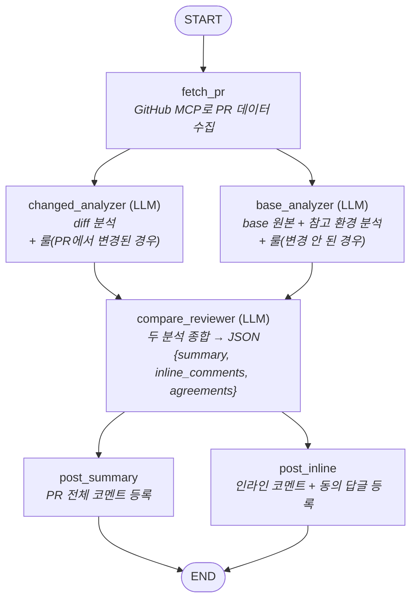

# GitOps PR 리뷰봇

LangGraph + GitHub MCP + 로컬 LLM(OpenAI-compatible)으로 GitOps 레포 PR을 자동 리뷰한다.

## LangGraph 파이프라인 구조

노드 6개를 가진 `StateGraph` 하나로 구성된다. 전체 정의는 [graph.py](graph.py)의 `build_graph()`.



### 왜 LangGraph인가

흐름이 단순 직선이면 프레임워크 없이 함수 호출로 충분하다. 이 파이프라인은
**병렬 구간이 두 번** 있어서 LangGraph의 fan-out/join이 실질적인 가치를 갖는다:

1. 분석 단계 — changed_analyzer와 base_analyzer는 서로 입력이 독립적(diff vs base 원본)이라 동시 실행
2. 게시 단계 — 전체 코멘트와 인라인 코멘트는 서로 다른 GitHub API라 동시 실행

### 병렬 실행과 join의 동작 원리

```python
g.add_edge("fetch_pr", "changed_analyzer")   # ┐ fetch_pr가 끝나면
g.add_edge("fetch_pr", "base_analyzer")      # ┘ 두 노드가 동시에 시작 (fan-out)
g.add_edge(["changed_analyzer", "base_analyzer"], "compare_reviewer")  # join
```

- 한 노드에서 나가는 edge가 2개면 LangGraph가 같은 superstep에서 두 노드를 **동시에** 실행한다.
- `add_edge([a, b], c)` 형태의 join은 a, b가 **둘 다 끝나야** c를 시작한다.
- 병렬 노드들이 같은 State를 동시에 쓰면 충돌이 나므로, 각 노드는 **서로 다른 키에만 기록**한다
  (changed_analyzer→`changed_analysis`, base_analyzer→`base_analysis`,
  post_summary→`posted_summary`, post_inline→`posted_inline`/`posted_agreements`).
  덕분에 reducer 없이 기본 State 병합으로 충분하다.

### ReviewState — 노드 간 데이터 흐름

State는 `TypedDict`이며, 각 노드는 입력으로 전체 State를 받고 자신이 만든 키만 반환한다.

| 키 | 쓰는 노드 | 읽는 노드 | 내용 |
|---|---|---|---|
| `annotated_diff`, `diff_by_file`, `valid_lines` | fetch_pr | analyzer/reviewer, reviewer 검증 | 라인번호(R/L) 주석 diff, 파일별 분할본, 코멘트 가능 라인 집합 |
| `rule_changed`, `head_rules`, `base_rules` | fetch_pr | changed/base_analyzer | REVIEW_RULE.md 분기 결과 |
| `base_files`, `peer_map`, `peer_files`, `missing_peers` | fetch_pr | base_analyzer | base 원본, 참고 환경 대응 파일 |
| `existing_comments` | fetch_pr | compare_reviewer, post_inline | 이미 달린 코멘트 (중복 방지용) |
| `changed_analysis` / `base_analysis` | 각 analyzer | compare_reviewer | 분석 결과 텍스트 |
| `review_summary`, `inline_comments`, `dropped_comments`, `agreements` | compare_reviewer | post_summary, post_inline | 최종 리뷰 (검증 완료) |
| `posted_*` | post 노드들 | main.py | 등록 결과 집계 |

### 노드별 역할 요약

| 노드 | LLM 호출 | 하는 일 |
|---|---|---|
| `fetch_pr` | ✗ | PR 메타/diff/파일/기존 코멘트 수집, REVIEW_RULE.md 분기, 참고 환경 peer 수집, diff 파싱·라인번호 주석 |
| `changed_analyzer` | ✓ (배치 N회) | "무엇이 바뀌었나" — diff 분석, 룰이 PR에서 변경됐으면 head 룰 기준 평가 |
| `base_analyzer` | ✓ (배치 N회) | "원래 어땠나" — base 원본·컨벤션 분석, 기존 룰 매핑, 참고 환경 간 통일 여부 비교 |
| `compare_reviewer` | ✓ (배치 N회 + 병합 1회) | 두 분석 비교·종합, 구조화 JSON 출력, 인라인 라인 검증, 기존 코멘트와 중복 분리(agreements) |
| `post_summary` | ✗ | summary + 탈락 코멘트를 PR 전체 코멘트로 등록 |
| `post_inline` | ✗ | pending review 흐름으로 인라인 코멘트 등록 + 기존 코멘트 동의 답글 |

배치 처리(대형 PR)는 **그래프 구조가 아니라 노드 내부**에서 일어난다 — LLM을 쓰는 노드가
입력이 호출당 예산을 넘으면 `asyncio.gather`로 배치를 병렬 호출하고 결과를 병합해서
하나의 State 키로 반환한다. 그래프 토폴로지는 PR 크기와 무관하게 항상 동일하다.

## 동작 특징

- **REVIEW_RULE.md 분기**: PR에서 REVIEW_RULE.md가 변경됐으면 changed_analyzer가 head 버전을 읽고,
  변경 안 됐으면 base_analyzer가 변경 파일들의 상위 디렉토리를 거슬러 올라가며
  base 브랜치의 REVIEW_RULE.md를 찾아 읽는다 (`gitops/lcm-manila/REVIEW_RULE.md` 등).
- **참고 환경 교차 비교**: REVIEW_RULE.md에 `reference_environments` yaml 블록으로 환경 그룹을
  선언하면, 변경 파일 경로의 환경 세그먼트를 같은 그룹의 다른 환경으로 치환해
  **PR에서 변경되지 않은 대응 파일**도 읽어온다. base_analyzer가 환경 간 값을 비교해
  통일 여부 / 의도된 차이 여부를 분석하고, compare_reviewer가 리뷰에 반영한다.
  포맷은 [REVIEW_RULE.example.md](REVIEW_RULE.example.md) 참고.
- **대형 PR 지원**: diff를 자르지 않는다. 호출당 예산(`max_diff_chars` 등)을 넘으면
  파일 단위 배치로 쪼개 LLM을 여러 번 호출(동시 `--llm-concurrency`개)하고,
  summary는 별도 병합 호출로, 인라인 코멘트는 중복 제거 후 합친다.
- **리뷰 중복 방지**: 이미 PR에 달린 코멘트(봇/사람 모두)를 읽어 reviewer에 전달한다.
  같은 취지의 지적은 새로 달지 않고, 기존 인라인 코멘트 스레드에 "동일한 의견입니다"
  답글을 단다 (답글 미지원 서버면 원문 인용 일반 코멘트로 fallback).
- **느린 로컬 LLM 대응**: 호출당 타임아웃 기본 600초(`--llm-timeout`),
  실패 시 자동 재시도(`--llm-retries`), 동시 호출 수 제한(`--llm-concurrency`).
- **인라인 코멘트 검증**: diff를 파싱해 라인번호 주석(R/L)을 붙여 LLM에 주고,
  LLM이 지정한 (path, line, side)가 실제 diff 안에 있는지 검증한다.
  검증 실패한 코멘트는 PR 전체 코멘트 하단에 "기타 지적"으로 합쳐진다.

## 파일 구성

`graph.py`가 중심이고 나머지는 그래프 노드들이 쓰는 도구다. LangChain은 쓰지 않는다
(LLM은 openai SDK 직접 호출, GitHub은 mcp SDK 직접 호출).

| 파일 | 역할 | 의존 |
|---|---|---|
| `main.py` | 엔트리포인트 — MCP 세션을 열고 그래프를 1회 실행 | config, github_mcp, graph, llm |
| `graph.py` | **파이프라인 본체** — 노드 6개 정의 + 와이어링, 배치 처리, JSON 파싱/검증 | 아래 전부 |
| `config.py` | CLI 인자/환경변수 → `Config` (호출당 예산, 타임아웃 등 튜닝값 포함) | — |
| `github_mcp.py` | GitHub MCP stdio 클라이언트 래퍼 — 툴 이름은 상단 `TOOLS` 딕셔너리에 집중 | mcp SDK |
| `llm.py` | OpenAI-compatible LLM 래퍼 — 타임아웃/재시도/동시성 제한 | openai SDK |
| `diff_utils.py` | diff 파싱·라인번호 주석, 파일 단위 분할, 배치 패킹, 인라인 코멘트 검증 | — |
| `rules.py` | REVIEW_RULE.md의 `reference_environments` 파싱, 참고 환경 경로 생성 | pyyaml |
| `prompts.py` | 에이전트 3개 + JSON 복구 + summary 병합 프롬프트 | — |
| `REVIEW_RULE.example.md` | 룰 파일 권장 포맷 예시 | — |

## 설정

모든 값은 CLI 파라미터 또는 환경변수로 줄 수 있다. **CLI 인자 > 환경변수** 우선순위.

| CLI 파라미터 | 환경변수 | 필수 | 설명 |
|---|---|---|---|
| `--github-token` | `GITHUB_TOKEN` | ✅ | GitHub PAT (repo, PR 읽기/코멘트 권한) |
| `--repo` | `GITHUB_REPOSITORY` | ✅ | `owner/repo` (env는 `REPO_OWNER`+`REPO_NAME` 분리형도 허용) |
| `--pr-number` | `PR_NUMBER` | ✅ | 리뷰할 PR 번호 |
| `--llm-base-url` | `LLM_BASE_URL` | ✅ | 로컬 LLM OpenAI-compatible 엔드포인트 (예: `http://llm:8000/v1`) |
| `--llm-model` | `LLM_MODEL` | ✅ | 모델 이름 |
| `--llm-api-key` | `LLM_API_KEY` | | 기본 `dummy` |
| `--llm-timeout` | `LLM_TIMEOUT` | | LLM 호출당 대기 시간(초), 기본 `600` |
| `--llm-retries` | `LLM_MAX_RETRIES` | | 호출 실패 시 재시도 횟수, 기본 `2` |
| `--llm-concurrency` | `LLM_CONCURRENCY` | | LLM 동시 호출 수, 기본 `2` |
| `--mcp-cmd` | `GITHUB_MCP_CMD` | | MCP 서버 실행 커맨드. 기본: `docker run -i --rm -e GITHUB_PERSONAL_ACCESS_TOKEN ghcr.io/github/github-mcp-server`. 바이너리가 있으면 `github-mcp-server stdio` |
| `--language` | `REVIEW_LANGUAGE` | | 리뷰 언어, 기본 `Korean` |
| `--dry-run` | `DRY_RUN=1` | | GitHub에 게시하지 않고 로그로만 출력 |

## 실행

```bash
pip install -r requirements.txt

# CLI 파라미터로
python main.py \
  --github-token ghp_xxx \
  --repo my-org/gitops \
  --pr-number 123 \
  --llm-base-url http://localhost:8000/v1 \
  --llm-model qwen2.5-32b-instruct \
  --dry-run                # 먼저 dry-run으로 테스트 권장

# 또는 환경변수로
export GITHUB_TOKEN=ghp_xxx
export GITHUB_REPOSITORY=my-org/gitops
export PR_NUMBER=123
export LLM_BASE_URL=http://localhost:8000/v1
export LLM_MODEL=qwen2.5-32b-instruct
python main.py
```

## Jenkins 연동 예시

GitHub webhook(PR opened/synchronize) → Generic Webhook Trigger로 PR 번호를 받는 형태.

```groovy
pipeline {
    agent any
    parameters {
        string(name: 'PR_NUMBER', description: 'PR 번호')
    }
    environment {
        GITHUB_TOKEN      = credentials('github-token')
        GITHUB_REPOSITORY = 'my-org/gitops'
        LLM_BASE_URL      = 'http://llm.internal:8000/v1'
        LLM_MODEL         = 'qwen2.5-32b-instruct'
    }
    stages {
        stage('Review') {
            steps {
                sh '''
                    python3 -m venv .venv && . .venv/bin/activate
                    pip install -r requirements.txt
                    python main.py
                '''
            }
        }
    }
}
```

## 참고

- GitHub MCP 서버 버전에 따라 툴 이름이 다를 수 있다.
  `github_mcp.py` 상단 `TOOLS` 딕셔너리만 맞춰주면 된다.
  (현재 기준: `get_pull_request`, `get_pull_request_files`, `get_pull_request_diff`,
  `get_file_contents`, `add_issue_comment`, `get_issue_comments`,
  `get_pull_request_comments`, `create_pending_pull_request_review`,
  `add_comment_to_pending_review`, `submit_pending_pull_request_review`.
  답글용 `add_pull_request_review_comment`는 서버 버전에 따라 없을 수 있으며,
  없으면 자동으로 일반 코멘트 fallback)
- diff/파일 크기 상한(`config.py`의 `max_*`)을 로컬 LLM 컨텍스트 길이에 맞게 조정할 것.
